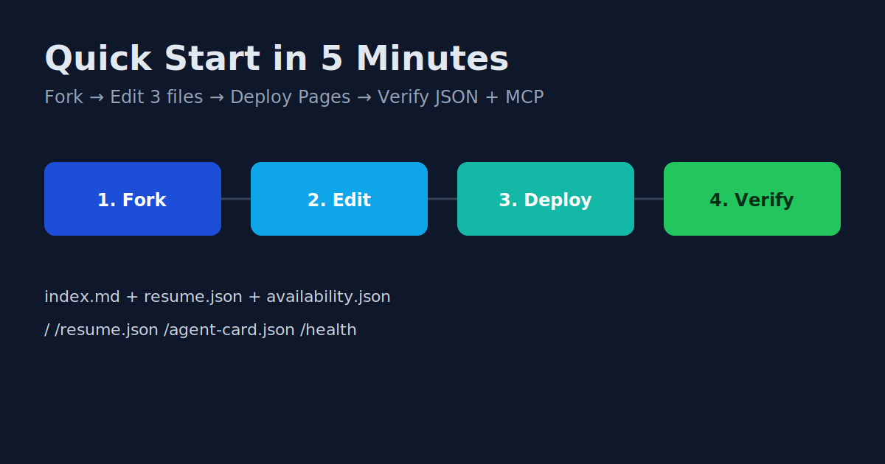
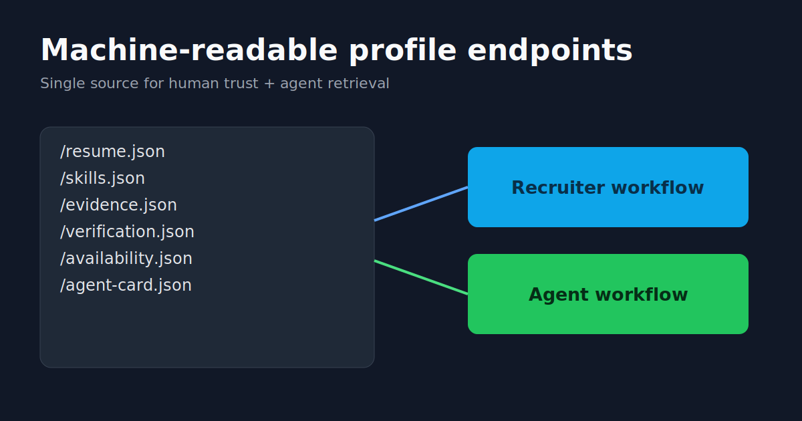
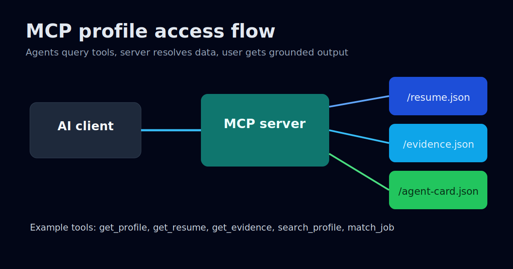
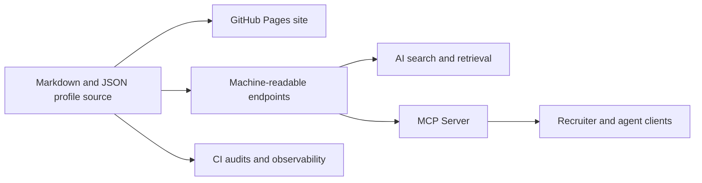

# AI-Ready Portfolio Starter

<p align="left">
  <a href="https://github.com/vassiliylakhonin/vassiliylakhonin.github.io/stargazers"></a>
  <a href="https://github.com/vassiliylakhonin/vassiliylakhonin.github.io/network/members"></a>
  <a href="https://github.com/vassiliylakhonin/vassiliylakhonin.github.io/actions/workflows/link-check.yml"></a>
  <a href="https://vassiliylakhonin.github.io/"></a>
  <a href="./LICENSE"></a>
</p>

Build an AI-ready professional profile in about 30 minutes: human-readable website + machine-readable profile data + MCP endpoint.

## Why this exists

Most portfolio sites are readable but not machine-usable. Most structured CVs are parseable but weak for humans. This project combines both in one repo, with validation and trust signals.

## 5-minute quick start

1. **Fork this repo**.
2. Edit these 3 files first:
   - `index.md` (human profile page)
   - `resume.json` (machine-readable profile)
   - `availability.json` (status and role targeting)
3. Enable GitHub Pages (Settings -> Pages -> Deploy from branch `main`).
4. Open your live URL and verify these endpoints:
   - `/`
   - `/resume.json`
   - `/agent-card.json`
5. Optional: run MCP locally.

```bash
git clone https://github.com/<you>/<your-repo>.git
cd <your-repo>
python3 -m pip install -r mcp/requirements.txt
python3 mcp/server.py --http
```

Then test:
- `http://localhost:8000/health`
- `http://localhost:8000/sse`

## Demo snapshots

### 1) Quick start flow



### 2) Machine-readable profile layer



### 3) MCP integration flow



## What you get

- Human-friendly profile site (GitHub Pages + Jekyll)
- Structured profile endpoints (`resume.json`, `skills.json`, `evidence.json`, `verification.json`)
- Agent discovery entrypoints (`agent-card.json`, `agent-discovery.md`, `llms.txt`)
- MCP server for recruiter/agent queries (`mcp/server.py`)
- CI checks for links, schema coverage, GEO baseline, and observability snapshots

## Live reference implementation

- Site: <https://vassiliylakhonin.github.io/>
- Recruiter page: <https://vassiliylakhonin.github.io/for-recruiters.html>
- CV PDF: <https://vassiliylakhonin.github.io/Vassiliy-Lakhonin_CV.pdf>
- ATS resume (plain): <https://vassiliylakhonin.github.io/Vassiliy-Lakhonin_ATS-Resume.html>
- Agent card: <https://vassiliylakhonin.github.io/agent-card.json>
- Resume JSON: <https://vassiliylakhonin.github.io/resume.json>
- MCP SSE: <https://vassiliy-lakhonin-mcp-production.up.railway.app/sse>
- MCP health: <https://vassiliy-lakhonin-mcp-production.up.railway.app/health>

## Repository map

```text
.
├── index.md
├── for-recruiters.md
├── profile.md
├── resume.json
├── capabilities.json
├── evidence.json
├── availability.json
├── skills.json
├── verification.json
├── agent-card.json
├── agent-discovery.md
├── llms.txt
├── mcp/
│   ├── server.py
│   ├── README.md
│   └── requirements.txt
├── scripts/
└── .github/workflows/
```

## Architecture (high level)



## Developer workflow

### Local content checks

```bash
python3 scripts/geo_quick_audit.py
python3 scripts/schema_audit.py
python3 scripts/build_readiness_report.py
python3 scripts/build_freshness_report.py
python3 scripts/build_evals_report.py
python3 scripts/build_provenance_report.py
```

### Serve site locally

```bash
bundle exec jekyll serve
```

## Trust and governance

- Contributing guide: [CONTRIBUTING.md](./CONTRIBUTING.md)
- Code of conduct: [CODE_OF_CONDUCT.md](./CODE_OF_CONDUCT.md)
- Security policy: [SECURITY.md](./SECURITY.md)
- Changelog: [CHANGELOG.md](./CHANGELOG.md)

## Roadmap (short)

- Starter profile preset with one-command setup
- Better docs for role-specific profile variants
- More MCP tools for matching, outreach, and profile QA
- Community showcase of profiles built from this repo

## Contributing

Small improvements are welcome: docs clarity, schema hardening, checks, and MCP reliability improvements. Start with issues labeled `good first issue`.

## License

MIT
